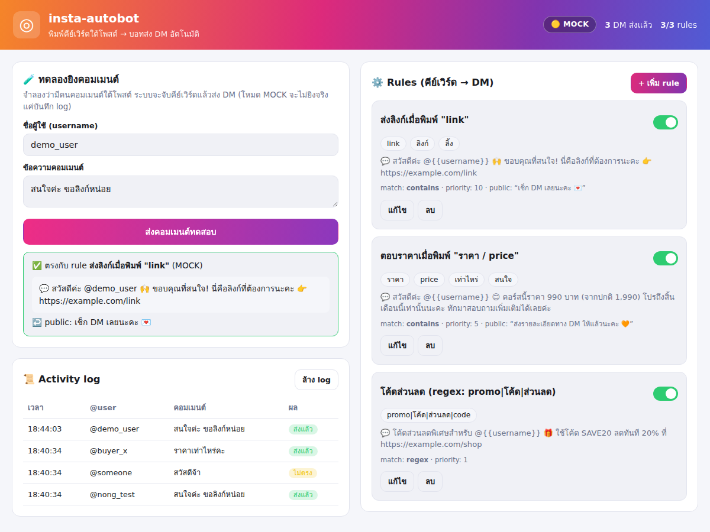

# insta-autobot 🤖💬

บอทตอบอัตโนมัติแบบ **comment-to-DM** สำหรับ Instagram — เมื่อมีคนพิมพ์
คีย์เวิร์ดใต้โพสต์/รีล (เช่น `link`, `ราคา`, `สนใจ`) บอทจะส่ง **DM อัตโนมัติ**
ให้คนนั้นทันที พร้อม dashboard สำหรับตั้งค่าคีย์เวิร์ด → ข้อความตอบกลับ
(แนวเดียวกับ ManyChat / เครื่องมือใน reel)

รันได้ทันทีใน **โหมด MOCK** (ไม่ต้องมี Instagram account/token — จำลองการส่ง
แล้วบันทึก log) และต่อ **Instagram Graph API** ได้จริงในโหมด LIVE



---

## ทำไมถึงเวิร์ก

Instagram (ผ่าน Meta Messenger Platform) รองรับการ **ส่ง private reply ไปยัง
คนที่คอมเมนต์** โดยตรง:

```
POST /{ig-account-id}/messages
{ "recipient": { "comment_id": "<COMMENT_ID>" }, "message": { "text": "..." } }
```

บอทนี้ทำงานเป็น pipeline สั้น ๆ:

```
คอมเมนต์เข้ามา (webhook)  ──►  rules engine จับคีย์เวิร์ด  ──►  ส่ง DM (+ ตอบคอมเมนต์)  ──►  log
```

---

## เริ่มใช้งาน (โหมด MOCK)

ต้องมี Node.js ≥ 20

```bash
cd insta-autobot
npm install
npm start
```

เปิด <http://localhost:3000> จะเห็น dashboard:

- **🧪 ทดลองยิงคอมเมนต์** — พิมพ์ข้อความจำลอง ดูว่า rule ไหนจับได้และ DM หน้าตาเป็นยังไง
- **⚙️ Rules** — เพิ่ม/แก้/ลบ/เปิด-ปิด คีย์เวิร์ด → ข้อความ DM
- **📜 Activity log** — ประวัติทุกคอมเมนต์ที่เข้ามาและผลลัพธ์

ในโหมด MOCK ระบบจะ **ไม่ยิงจริง** — แค่บันทึกว่าจะส่งอะไรไปหาใคร ปลอดภัยสำหรับทดลอง

---

## รูปแบบ Rule

| ฟิลด์ | ความหมาย |
|-------|----------|
| `name` | ชื่อ rule (แสดงใน dashboard) |
| `keywords` | รายการคีย์เวิร์ด (คั่นด้วย `,`) |
| `matchType` | `contains` (มีคำนี้อยู่), `word` (ตรงทั้งคำ), `exact` (ตรงทั้งข้อความ), `regex` |
| `caseSensitive` | สนใจตัวพิมพ์เล็ก/ใหญ่หรือไม่ (ดีฟอลต์ไม่สน) |
| `dmMessage` | ข้อความ DM ที่จะส่ง — ใช้ `{{username}}` แทนชื่อผู้คอมเมนต์ได้ |
| `publicReply` | (ไม่บังคับ) ข้อความตอบใต้คอมเมนต์แบบสาธารณะ |
| `priority` | ถ้าหลาย rule ตรงพร้อมกัน อันที่ priority สูงกว่าชนะ |
| `active` | เปิด/ปิดการใช้งาน |

Rule จะถูกเก็บไว้ที่ `data/rules.json` (สร้างจาก `data/rules.seed.json` ครั้งแรก)

---

## เชื่อมต่อ Instagram จริง (โหมด LIVE)

1. **บัญชี**: แปลง Instagram เป็นบัญชี Professional (Business/Creator) แล้วผูกกับ Facebook Page
2. **Meta app**: สร้างแอปที่ <https://developers.facebook.com> เพิ่มผลิตภัณฑ์
   *Instagram* / *Messenger* ขอสิทธิ์:
   `instagram_manage_comments`, `instagram_manage_messages`, `pages_manage_metadata`
3. **Token**: สร้าง long-lived Page access token
4. **ตั้งค่า**: คัดลอก `.env.example` เป็น `.env` แล้วเติมค่า

   ```bash
   cp .env.example .env
   # แก้ไข:
   BOT_MODE=live
   IG_ACCESS_TOKEN=EAAB...
   IG_ACCOUNT_ID=1784xxxxxxxxx
   WEBHOOK_VERIFY_TOKEN=ตั้งข้อความอะไรก็ได้
   ```

5. **Webhook**: เปิดเซิร์ฟเวอร์ให้เข้าถึงจากภายนอก (เช่น `ngrok http 3000`) แล้ว
   ตั้ง Callback URL = `https://<your-domain>/webhook`, Verify Token = ค่าเดียวกับ
   `WEBHOOK_VERIFY_TOKEN`, subscribe field **`comments`**

เมื่อ `BOT_MODE=live` และมี token ครบ แถบสถานะจะเปลี่ยนเป็น 🟢 **LIVE** และ DM จะถูกส่งจริง

> ⚠️ ปฏิบัติตามนโยบายแพลตฟอร์มของ Meta (มี rate limit และข้อกำหนดเรื่อง 24-hour
> messaging window) และหลีกเลี่ยงพฤติกรรมสแปม

---

## API endpoints

| Method | Path | ใช้ทำอะไร |
|--------|------|-----------|
| `GET` | `/api/status` | โหมด/สถิติ |
| `GET/POST` | `/api/rules` | อ่าน/สร้าง rule |
| `PUT/PATCH/DELETE` | `/api/rules/:id` | แก้/สลับ active/ลบ |
| `POST` | `/api/simulate` | จำลองคอมเมนต์ `{ text, username }` |
| `GET/DELETE` | `/api/logs` | อ่าน/ล้าง log |
| `GET/POST` | `/webhook` | Instagram webhook (verify + รับ event) |

---

## เทสต์

```bash
npm test
```

ทดสอบ rules engine (การจับคู่คีย์เวิร์ด, priority, regex, การ validate) ด้วย
`node:test` ที่มากับ Node ไม่ต้องลง dependency เพิ่ม

---

## โครงสร้างไฟล์

```
insta-autobot/
├── server.js            # Express: dashboard + API + webhook
├── src/
│   ├── config.js        # โหลด .env / โหมด mock|live
│   ├── store.js         # เก็บ rules + logs เป็นไฟล์ JSON
│   ├── rulesEngine.js   # ตรรกะจับคีย์เวิร์ด (pure, มีเทสต์)
│   ├── instagram.js     # Graph API client (mock + live)
│   ├── processor.js     # รวม engine + ส่ง DM + log
│   ├── webhook.js       # verify + แปลง payload ของ Meta
│   └── api.js           # REST API ให้ dashboard
├── public/              # dashboard (HTML/CSS/JS ล้วน)
├── data/rules.seed.json # rule ตัวอย่างเริ่มต้น
└── test/
```

MIT License
